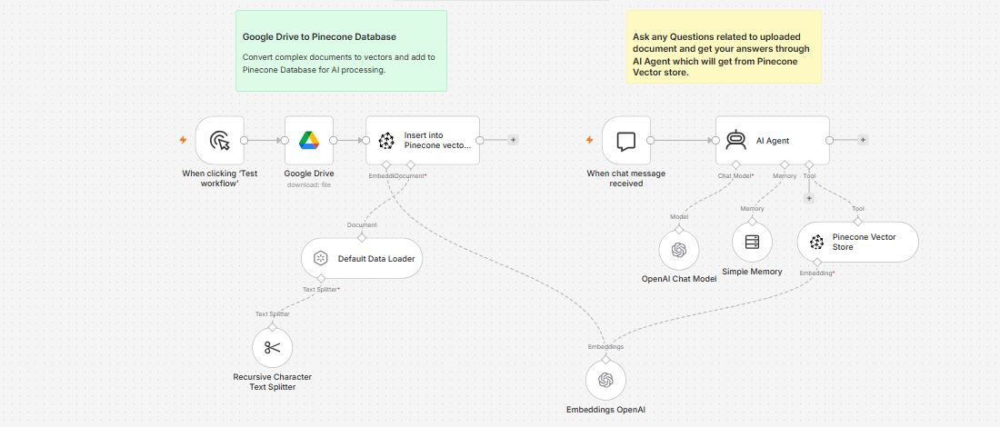

# 📚 Pinecone Vector Database AI Agent using n8n


---

# 📖 Overview

This project demonstrates a complete **Retrieval-Augmented Generation (RAG)** application built using **n8n**, **OpenAI**, **Google Drive**, and **Pinecone Vector Database**.

Instead of relying solely on an LLM's general knowledge, the workflow enables an AI Agent to answer questions using your own uploaded documents.

The workflow consists of two major phases.

The first phase automatically downloads documents from Google Drive, splits them into smaller chunks, converts them into OpenAI embeddings, and stores those vectors inside Pinecone.

The second phase allows users to ask questions through an AI Chat interface. The AI Agent first searches Pinecone for relevant document chunks and then generates answers using only the retrieved information.

This architecture significantly reduces hallucinations while enabling accurate document-based question answering.

---

# 🖼️ Workflow Layout



---

# ✨ Features

* 📄 Automatic Google Drive document ingestion
* 🧠 OpenAI Embedding Generation
* 📚 Automatic Document Chunking
* 🗂 Pinecone Vector Database Storage
* 🤖 AI-powered Question Answering
* 🔍 Semantic Vector Search
* 💬 Chat-based AI Interface
* 🧠 Conversation Memory Support
* 📈 Scalable Knowledge Base
* ⚡ Retrieval-Augmented Generation (RAG)

---

# 🎯 Use Cases

## 📑 Internal Company Knowledge Base

Allow employees to search company documentation using AI.

---

## 📘 PDF Question Answering

Upload reports, manuals, or books and ask questions in natural language.

---

## 📊 Financial Reports

Search quarterly reports and annual statements using AI.

---

## 🏥 Healthcare Documents

Retrieve information from medical documentation.

---

## 🎓 Educational Material

Upload textbooks, notes, and lecture PDFs.

---

## ⚖ Legal Documents

Ask questions related to contracts or legal agreements.

---

## 🏢 Enterprise Search

Create an AI assistant for internal documentation.

---

# 🧠 How the Workflow Works

The workflow operates in two independent stages.

---

## 📂 Stage 1

### Document Processing

Google Drive downloads a document.

↓

Document is loaded.

↓

Text Splitter breaks the document into smaller chunks.

↓

OpenAI creates vector embeddings.

↓

Embeddings are inserted into Pinecone.

---

## 💬 Stage 2

### AI Question Answering

User asks a question.

↓

AI Agent searches Pinecone.

↓

Relevant document chunks are retrieved.

↓

OpenAI generates an answer using only retrieved content.

↓

Response is returned to the user.

---

# 🔄 Workflow Nodes

---

# 1️⃣ Manual Trigger

📌 **Node Type**

Manual Trigger

### 🎯 Purpose

Starts the document ingestion pipeline manually.

Useful when uploading new documents into Pinecone.

---

### Output

Triggers the Google Drive node.

---

# 2️⃣ Google Drive

📌 **Node Type**

Google Drive

### 🎯 Purpose

Downloads documents stored in Google Drive for processing. 

---

### Operation

Download File

---

### Important Parameters

| Parameter     | Value             |
| ------------- | ----------------- |
| Resource      | File              |
| Operation     | Download          |
| File ID       | Google Drive File |
| Binary Output | Enabled           |

---

### Supported File Types

* PDF
* DOCX
* TXT
* Markdown

---

### Output

Binary document

---

# 3️⃣ Recursive Character Text Splitter

📌 **Node Type**

Recursive Character Text Splitter

### 🎯 Purpose

Splits large documents into smaller overlapping chunks before embeddings are generated. 

---

### Configuration

| Parameter     | Value |
| ------------- | ----- |
| Chunk Size    | 3000  |
| Chunk Overlap | 200   |

---

### Why Chunking?

Large documents cannot fit into embedding models efficiently.

Chunking provides:

* Better retrieval accuracy
* Lower embedding cost
* Faster search
* More relevant context

---

# 4️⃣ Default Data Loader

📌 **Node Type**

Document Loader

### 🎯 Purpose

Reads the downloaded binary document and converts it into text before passing it to the embedding pipeline. 

---

### Supported Formats

* PDF
* DOCX
* TXT
* Markdown

---

### Output

Structured document object

---

# 5️⃣ OpenAI Embeddings

📌 **Node Type**

Embeddings OpenAI

### 🎯 Purpose

Converts every text chunk into numerical vector embeddings for semantic search. 

---

### Model

```text
text-embedding-3-small
```

---

### Why Embeddings?

Embeddings allow AI to understand semantic similarity instead of relying on exact keyword matching.

---

### Output

```json
{
  "embedding":[
    0.012,
    -0.433,
    0.274,
    ...
  ]
}
```

---

# 6️⃣ Insert into Pinecone Vector Store

📌 **Node Type**

Pinecone Vector Store

### 🎯 Purpose

Stores document embeddings inside a Pinecone index for future retrieval. 

---

### Configuration

| Parameter       | Value              |
| --------------- | ------------------ |
| Mode            | Insert             |
| Index           | n8n-pinecone-agent |
| Embedding Model | OpenAI             |

---

### Output

Successfully indexed document chunks.

---

# 7️⃣ Chat Trigger

📌 **Node Type**

Chat Trigger

### 🎯 Purpose

Starts the AI question-answering phase whenever a user submits a message. 

---

### Example Input

```json
{
  "question":"Summarize the quarterly financial report."
}
```

---

# 8️⃣ OpenAI Chat Model

📌 **Node Type**

OpenAI Chat Model

### 🎯 Purpose

Generates natural language responses using retrieved document context. 

---

### Connected To

* AI Agent
* Pinecone Tool
* Memory

---

# 9️⃣ Simple Memory

📌 **Node Type**

Simple Memory

### 🎯 Purpose

Maintains short-term conversation history so the AI Agent can understand follow-up questions without requiring the user to repeat previous context. 

---

### Benefits

* 🧠 Multi-turn conversations
* 💬 Context-aware responses
* 🔄 Better user experience
* 📚 Maintains chat history

---

# 🔟 Pinecone Vector Store (Retriever)

📌 **Node Type**

Pinecone Vector Store

### 🎯 Purpose

Searches the Pinecone index for document chunks that are semantically similar to the user's question before the AI generates a response. 

---

### Configuration

| Parameter        | Value                                        |
| ---------------- | -------------------------------------------- |
| Mode             | Retrieve as Tool                             |
| Index            | n8n-pinecone-vectordb-agent                  |
| Tool Description | Work with your data in Pinecone Vector Store |

---

### Output Example

```json
[
  {
    "page":12,
    "content":"NVIDIA announced Blackwell architecture..."
  },
  {
    "page":16,
    "content":"Revenue increased by 69% year-over-year..."
  }
]
```

---

# 1️⃣1️⃣ AI Agent

📌 **Node Type**

AI Agent

### 🎯 Purpose

Acts as the Retrieval-Augmented Generation (RAG) assistant.

Instead of answering directly from the LLM's built-in knowledge, the AI Agent first searches the Pinecone Vector Store, retrieves relevant document chunks, and then generates an answer grounded in the uploaded content. 

---

### Connected Components

* 🤖 OpenAI Chat Model
* 🧠 Simple Memory
* 📚 Pinecone Vector Store Tool

---

### System Prompt Responsibilities

* Always search Pinecone before answering.
* Use retrieved document context.
* Avoid hallucinations.
* Inform the user if no relevant information exists.
* Restrict answers to uploaded documents unless explicitly instructed otherwise.

---

### Example Question

```text
What are the major highlights from NVIDIA's quarterly presentation?
```

---

### Example Response

```text
According to the uploaded presentation, NVIDIA reported strong growth driven by AI infrastructure demand, introduced advancements in the Blackwell architecture, and highlighted expansion in enterprise AI deployments.
```

---

# 🔐 Required Credentials

## 🤖 OpenAI

### Required For

* Chat Model
* Embeddings

Credential

```text
OPENAI_API_KEY
```

---

## 📚 Pinecone

### Required For

* Vector Storage
* Semantic Retrieval

Credential

```text
PINECONE_API_KEY
```

Additional Configuration

| Parameter   | Example                    |
| ----------- | -------------------------- |
| Environment | us-east-1                  |
| Index Name  | n8n-pinecone-agent         |
| Dimension   | Depends on embedding model |

---

## 📂 Google Drive

### Required For

Downloading source documents.

Credential

```text
Google OAuth2
```

Permissions

* Google Drive Read Access

---

# ⚙️ Installation

## Step 1

Import **pinecone-vector-database-agent.json** into n8n.

---

## Step 2

Create an OpenAI credential and add your API key.

---

## Step 3

Create a Pinecone API credential.

---

## Step 4

Create a Google Drive OAuth2 credential.

---

## Step 5

Create a Pinecone index.

Example

```text
n8n-pinecone-agent
```

---

## Step 6

Update the Google Drive node with your file or folder.

---

## Step 7

Run the workflow once to ingest documents.

---

## Step 8

Verify vectors have been inserted into Pinecone.

---

## Step 9

Open the Chat interface.

---

## Step 10

Ask questions about the uploaded document.

---

# 🎨 Customization Ideas

* 📂 Index entire Google Drive folders
* 📄 Support DOCX, PPTX, Markdown, HTML, and CSV
* 🌍 Multi-language document search
* 🔐 User-based document permissions
* 📊 Document metadata filtering
* ☁️ Google Drive synchronization
* 📑 Automatic re-indexing of updated documents
* 🤖 Hybrid Search (Vector + Keyword)
* 🧠 Long-term conversation memory
* 📈 Citation-aware responses with page references

---

# 🛠️ Troubleshooting

| Problem                           | Cause                         | Solution                                       |
| --------------------------------- | ----------------------------- | ---------------------------------------------- |
| No embeddings generated           | Invalid OpenAI API key        | Verify OpenAI credentials                      |
| Pinecone insert failed            | Index not found               | Create the index before running                |
| No search results                 | Empty vector database         | Run the ingestion stage first                  |
| Google Drive download error       | OAuth permissions             | Reconnect Google Drive credentials             |
| AI answers from general knowledge | Retrieval tool not connected  | Ensure Pinecone Tool is linked to the AI Agent |
| Poor retrieval quality            | Chunk size too large or small | Adjust text splitter settings and re-index     |

---

# 💻 Technologies Used

* n8n
* OpenAI GPT-4o / GPT-4o Mini
* OpenAI Embeddings (`text-embedding-3-small`)
* Pinecone Vector Database
* Google Drive API
* LangChain Nodes for n8n
* Retrieval-Augmented Generation (RAG)
* JavaScript
* JSON

---

# 🚀 Future Improvements

* 📄 Support multiple document formats (PPTX, XLSX, HTML)
* 📚 Automatic folder synchronization from Google Drive
* 🔍 Hybrid search (vector + keyword)
* 📝 AI-generated citations with page numbers
* 👥 User authentication and role-based access
* 🌐 Multilingual document indexing
* ☁️ Integrations with SharePoint, Notion, and Confluence
* 📊 Usage analytics and query history dashboard
* 🧠 Long-term memory with conversation persistence

---

# 🤝 Contributing

Contributions are welcome! Feel free to fork the repository, report issues, or submit pull requests to improve the workflow, prompts, or integrations.

---

# ⭐ Support

If you found this workflow useful, consider giving the repository a **⭐ Star** on GitHub. It helps others discover the project and supports continued development.
